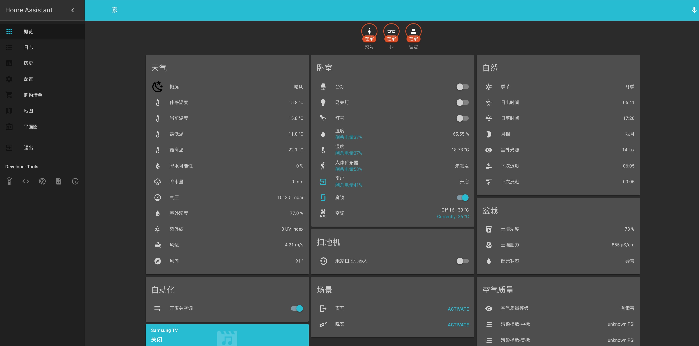
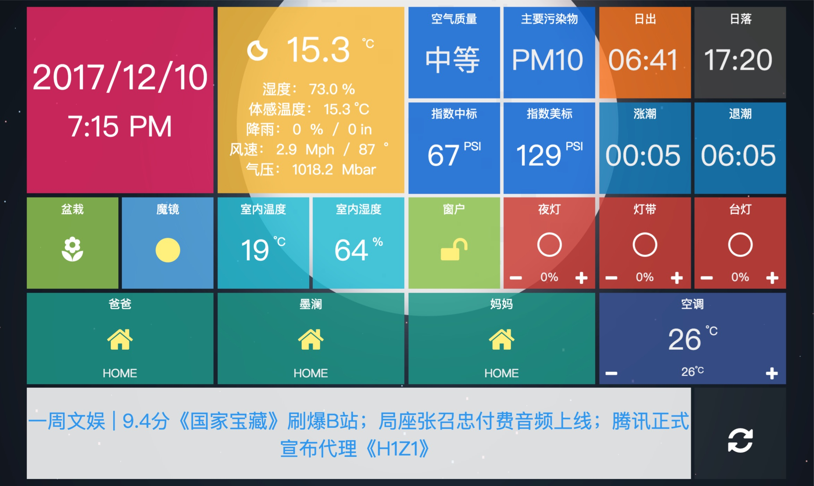
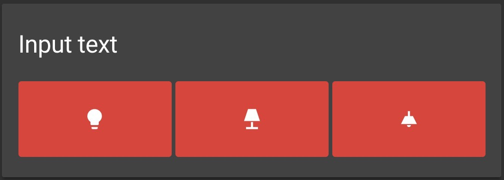

# README

## 简体中文：
此 repo 同步我的 HA 配置，主配置文件添加了汉化注释及分块，可参考的内容有：

- 个性化配置
    - 暗色主题（来自社区）
    - Template 模板的活用
    - Custom UI - update.sh 文件用于更新
    - Custom UI Tiles
    - Custom Panel iFrame
    - Homebridge 活用 （模拟设备）
 
- 3D 活点平面图

    展示信息有：室内温湿度，PS4 开关状态及游玩游戏显示，开关及灯具等的状态及操控，家庭成员在家情况，盆栽健康状况，动态月相以及场景开关。
    

- 自制中文地图面板

	
    
    详见 [项目 Github](https://github.com/cxlwill/ha-inkwavemap)。
 
- HADashboard

	主题使用 Metro。
	
- 接入设备配置

    - 花花草草监测仪
    - 小米多功能网关
        
        - 人体传感器
        - 温湿度传感器
        - Zigbee 插座
        - 无线开关
        
    - 米家空调伴侣
    - 米家扫地机器人
    - Yeelight 台灯、灯带
    - 飞利浦球泡灯
    - 华硕路由器
    - PS4
    - Apple TV
    - VLC
    - Air Visual
    - Dark sky 天气
    - 树莓派摄像头
    - WorldTide 潮汐预报
    - 百度 TTS
 
##  English
This repo contains my personal HA configuration, which including:

- Devices

    - Mi Flora Sensor
    - Xiaomi Gateway & Zigbee devices
            
        - Motion Sensor
        - Temp&Hum Sensor
        - Zigbee Plug
        - Button
        

    - MiHome AC Partner
    - ASUS router
    - PS4
    - Apple TV
    - VLC
    - Air Visual
    - Raspberry Pi Camera

- Customization

    - Localization of entity & attribute
    - Some dark themes (from community)
    - Use of different kinds of Template
 
- 3D Floorplan
    The Floorplan shows information of :
    
    Temp&Humidity indoors, State of PS4 and Games' name playing, State of switches and light, Presence Detection, State of Flowers, Dynamic moon phrase and Scenes.
 
- Custom Chinese Map Panel
	For details, plz see Project's [Github page](https://github.com/cxlwill/ha-inkwavemap).

